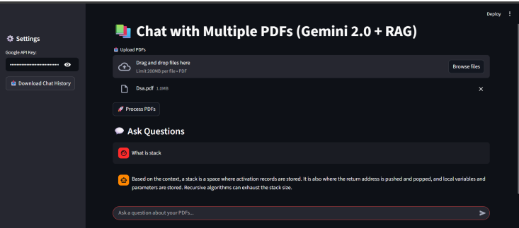
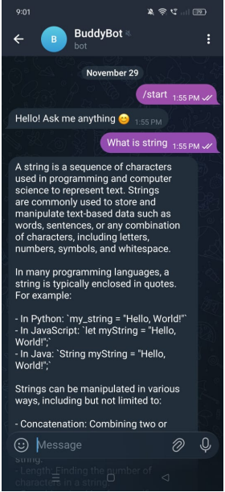

# 🤖 AI-Powered RAG Chatbot

An **AI-powered Retrieval-Augmented Generation (RAG) chatbot** that uses uploaded PDF documents as a knowledge base to provide context-aware and document-grounded responses.

The project combines **LangChain, Google Gemini, FAISS, and Streamlit** to implement a complete document question-answering pipeline. It also provides **Telegram integration**, allowing users to interact with the chatbot from both a desktop web interface and a mobile messaging platform.

---

## 🚀 Project Overview

Traditional AI chatbots can sometimes generate responses that are not supported by the provided information. This project addresses that limitation using **Retrieval-Augmented Generation (RAG)**.

Instead of relying only on the LLM's pre-trained knowledge, the chatbot:

1. Accepts PDF documents as the knowledge source.
2. Extracts text from the documents.
3. Splits the text into smaller chunks.
4. Converts the chunks into vector embeddings.
5. Stores the embeddings in a **FAISS vector database**.
6. Retrieves the most relevant document sections for a user query.
7. Sends the retrieved context to **Google Gemini**.
8. Generates a response grounded in the retrieved information.

This approach helps improve the relevance and reliability of responses for document-based queries.

---

## 🎯 Project Objectives

### 1. Document-Based Question Answering

Allow users to ask questions about uploaded PDF documents and receive answers based on the document content.

### 2. Context-Aware Responses

Retrieve relevant sections of the knowledge base before generating an answer, allowing the LLM to respond using relevant context.

### 3. Reduce Unsupported Responses

Use retrieved document context to reduce the likelihood of generating information that is unrelated to the provided documents.

### 4. Multi-Platform Accessibility

Provide two ways to interact with the chatbot:

* 🖥️ Streamlit web application
* 📱 Telegram chatbot

---

## 🏗️ System Architecture

```text
                    ┌─────────────────────┐
                    │    PDF Documents    │
                    └──────────┬──────────┘
                               │
                               ▼
                    ┌─────────────────────┐
                    │   Text Extraction   │
                    └──────────┬──────────┘
                               │
                               ▼
                    ┌─────────────────────┐
                    │  Text Chunking      │
                    └──────────┬──────────┘
                               │
                               ▼
                    ┌─────────────────────┐
                    │  Embedding Model    │
                    └──────────┬──────────┘
                               │
                               ▼
                    ┌─────────────────────┐
                    │   FAISS Vector DB   │
                    └──────────┬──────────┘
                               │
                         User Question
                               │
                               ▼
                    ┌─────────────────────┐
                    │ Similarity Search   │
                    └──────────┬──────────┘
                               │
                               ▼
                    ┌─────────────────────┐
                    │ Relevant Context    │
                    └──────────┬──────────┘
                               │
                               ▼
                    ┌─────────────────────┐
                    │   Google Gemini     │
                    │       LLM           │
                    └──────────┬──────────┘
                               │
                               ▼
                    ┌─────────────────────┐
                    │     AI Response     │
                    └──────────┬──────────┘
                               │
                    ┌──────────┴──────────┐
                    ▼                     ▼
             Streamlit UI           Telegram Bot
```

---

## ✨ Key Features

### 📄 PDF Knowledge Base

* Upload PDF documents as the chatbot's knowledge source.
* Extract and process document text.
* Convert documents into searchable vector representations.

### 🔍 Semantic Document Retrieval

FAISS is used for efficient similarity-based retrieval of relevant document chunks.

This allows the system to retrieve information based on **meaning**, rather than relying only on exact keyword matches.

### 🧠 Generative AI

Google Gemini is used as the Large Language Model (LLM) to generate natural-language responses using the retrieved document context.

### 🔗 LangChain Integration

LangChain is used to connect the different components of the RAG pipeline, including:

* Document processing
* Text splitting
* Embeddings
* Retrieval
* Prompt construction
* LLM interaction

### 🖥️ Streamlit Interface

A simple web-based interface allows users to:

* Upload documents
* Enter questions
* Interact with the chatbot
* View generated responses

### 📱 Telegram Integration

The chatbot can also be accessed through Telegram, providing a convenient mobile interface for asking questions.

---

## 🛠️ Technology Stack

| Technology           | Purpose                                  |
| -------------------- | ---------------------------------------- |
| **Python**           | Core programming language                |
| **LangChain**        | RAG pipeline orchestration               |
| **Google Gemini**    | Large Language Model                     |
| **FAISS**            | Vector similarity search                 |
| **Streamlit**        | Web interface                            |
| **Telegram Bot API** | Mobile chatbot interface                 |
| **Embeddings**       | Convert text into vector representations |
| **PyPDF**            | PDF text extraction                      |

---

## 🔄 RAG Workflow

### Step 1 — Document Upload

The user uploads one or more PDF documents.

### Step 2 — Text Extraction

Text is extracted from the uploaded PDF files.

### Step 3 — Text Chunking

Large documents are divided into smaller chunks so that relevant sections can be retrieved efficiently.

### Step 4 — Generate Embeddings

Each text chunk is converted into a numerical vector representation using an embedding model.

### Step 5 — Vector Storage

The generated embeddings are stored in a **FAISS vector database**.

### Step 6 — User Query

The user enters a question through the Streamlit interface or Telegram.

### Step 7 — Similarity Search

The system searches the FAISS index to identify document chunks that are semantically relevant to the question.

### Step 8 — Context + Query

The retrieved document context is combined with the user's question.

### Step 9 — Gemini Response

The combined prompt is sent to Google Gemini, which generates a natural-language response.

### Step 10 — Response Delivery

The final answer is displayed through:

* Streamlit
* Telegram

---

## ▶️ Running the Streamlit Application

Run:

```bash
streamlit run app.py
```

The application will open in your browser.

Upload your PDF document and start asking questions.

---

## 📱 Running the Telegram Bot

After configuring the Telegram bot token:

```bash
python telegram_bot.py
```

Open Telegram, search for your configured bot, and send your questions.

---

## 💡 Example Use Cases

This chatbot can be adapted for different document-based applications.

### 🎓 Education

Upload:

* Lecture notes
* Textbooks
* Research papers
* Course materials

Ask:

> "Explain the main concepts discussed in Chapter 3."

### 🔬 Research

Upload research papers and ask:

> "What methodology was used in this paper?"

### 🏢 Enterprise

Upload:

* Company policies
* Internal documentation
* Product manuals
* Technical documents

Ask:

> "What is the procedure for requesting access?"

### 📚 Document Analysis

Upload a large PDF and ask specific questions without manually searching through the entire document.

---

## 📊 Advantages of RAG

Compared with a simple LLM chatbot, this architecture provides:

* Document-specific responses
* Semantic search
* External knowledge retrieval
* Reduced dependence on model pre-training
* Easier knowledge-base updates
* Better control over the information provided to the model

---

## ⚠️ Limitations

The system may still produce incorrect or incomplete answers when:

* The required information is not present in the documents.
* PDF text extraction fails.
* Documents contain complex tables or images.
* Retrieved chunks do not contain sufficient context.
* The LLM misinterprets the retrieved context.

Therefore, generated responses should be validated for important or high-stakes use cases.

---

## 🔮 Future Enhancements

Potential improvements include:

* [ ] Support for multiple document formats
* [ ] Conversation memory
* [ ] Source/page citations in responses
* [ ] Improved document chunking strategies
* [ ] Hybrid keyword + vector search
* [ ] Reranking of retrieved documents
* [ ] Authentication and user accounts
* [ ] Persistent vector database
* [ ] Streaming LLM responses
* [ ] Docker deployment
* [ ] Cloud deployment
* [ ] React-based frontend
* [ ] React Native mobile application

---

## 📸 Screenshots

Project screenshots here:

```markdown
 📸 Screenshots

### 🖥️ Streamlit Interface



### 📱 Telegram Bot


```

---

## 🔐 Security

API keys and sensitive credentials should never be committed to the repository.

Use environment variables:

```env
GOOGLE_API_KEY=your_api_key
TELEGRAM_BOT_TOKEN=your_bot_token
```

And add:

```text
.env
```

to `.gitignore`.

If an API key is accidentally pushed to GitHub, revoke it immediately and generate a new one.

---

## 📌 Learning Outcomes

Through this project, the following concepts are demonstrated:

* Retrieval-Augmented Generation (RAG)
* Large Language Models (LLMs)
* Prompt engineering
* Vector embeddings
* Semantic search
* Vector databases
* LangChain
* Google Gemini API
* FAISS
* PDF document processing
* Streamlit application development
* Telegram Bot API
* AI application integration

---

## 👨‍💻 Project Highlights

**Project Type:** Generative AI / RAG Application

**Primary Language:** Python

**AI Architecture:** Retrieval-Augmented Generation

**Interfaces:** Streamlit + Telegram

**LLM:** Google Gemini

**Vector Store:** FAISS

**Framework:** LangChain

---

## ⭐ Acknowledgements

This project uses open-source libraries and APIs including LangChain, FAISS, Streamlit, and Google Gemini.
